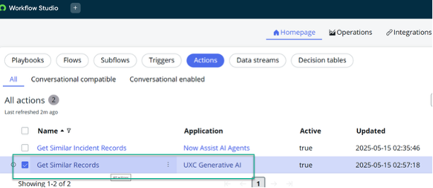
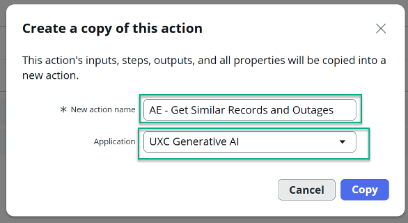

# Section A4: Application Scope

If you couldn’t find the “Platform AI Agents and Skills” application scope, then please look for “UXC Generative AI” and create your script under it.

<figure><figcaption></figcaption></figure>

And the action you are copying would be:\

\
\
 
