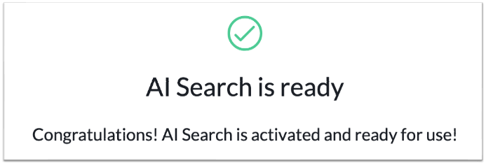

# Lab preparation

Before starting the lab, let’s make sure your lab instance is ready.

Log into the instance with the “Magic link” as Admin.

&#x20;Navigate to AI Search > AI Search Status

You should see a green check mark, like this:

&#x20;

&#x20;

<figure><figcaption></figcaption></figure>

If AI Search is NOT active, please click to go to the Appendix Section A3: AI Search Set-Up and follow the steps to repair your instance.

Otherwise, skip straight to the lab.
