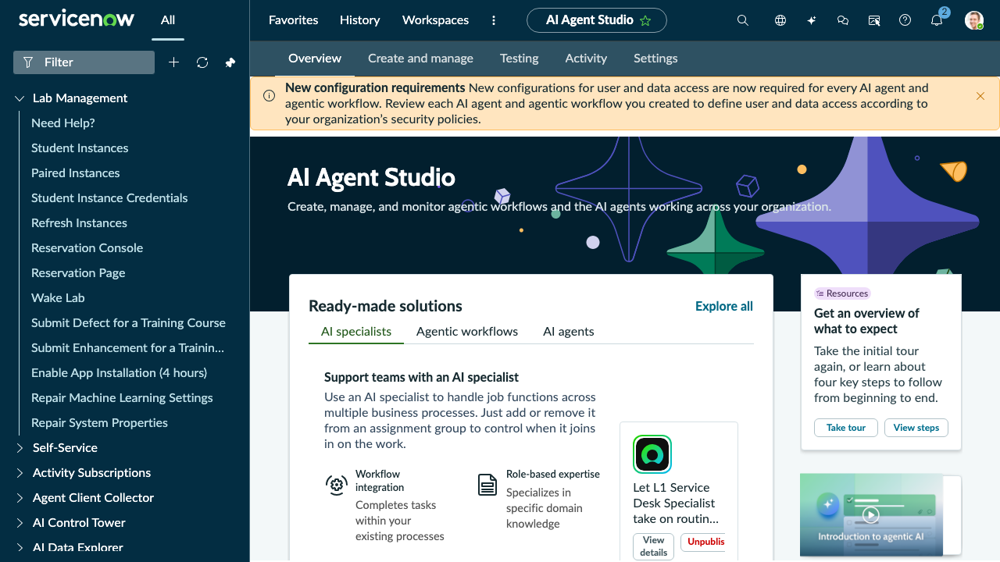

# Section 2.1 Build a Simple Agent


Note: In the following lab, we will talk through prompting many times. To learn more about prompting in ServiceNow, visit our community and our Product Manager’s [excellent guide on prompting by](https://www.servicenow.com/community/now-assist-articles/now-assist-ai-agents-prompting-guide/ta-p/3386242) clicking [HERE](https://www.servicenow.com/community/now-assist-articles/now-assist-ai-agents-prompting-guide/ta-p/3386242)


Now let’s begin!

1. Open AI Agent Studio (All > AI Agent Studio > Overview). The Overview page shows a "Ready-made solutions" section with tabs for AI specialists, Agentic workflows, and AI agents.

<figure><figcaption></figcaption></figure>

2. Click the **Create and manage** tab (top nav), then the **AI agents** tab, then click **Add**.
3. A configuration page for “New AI agent” will open. Complete the fields with the information given below. In the Define the specialty Area, click on **‘Generate details.’**
4. Copy and paste the following into the dialog, we will Now Assist in filling in our fields for us\
   \
   \&#xNAN;_I want my AI Agent to be a hospital campus concierge. Provide directions to visitors and patients. You are a hospital concierge whose job is to provide directions to specific hospital departments. You will always be friendly but favor brevity, so your messages are easy to read on mobile devices. If it hasn't already been provided, ask the visitor for their destination. Look up the supplied destination in the location tab. If you cannot find the destination, assume this is a lab environment and create a feasible answer—list directions to walk from the visitor’s or your current location to the destination. If you do not have the visitor's current location, assume they are in the hospital’s east wing, which is where the front door is. Provide the visitor with output directions as a numbered list._

<figure><figcaption></figcaption></figure>

5. Click on "**Generate"**

<figure><figcaption></figcaption></figure>


Tip: If you do not see the entry field for “AI Agent Role”, you may be in the wrong section! Check the upper left corner of the screen and confirm that you are in the “New AI Agent” setup.



Note: In a non-lab environment and with MCP, you could expose agents to third parties, add memory categories, or allow the agent to learn from past executions, but for this lab, we will NOT.


6. Click "**Save and continue.**"
7. Next is the “**Add tools and information**” section. We are not adding tools for this agent, so simply click “**Save and continue**”.
8. In Define security controls, click “**Save and continue**” on the following two steps
   1. Define user access -> select '**Any Authenticated user**’ from the User access drop-down, press "Save and continue".
   2. Define data access -> Select the **Dynamic user**, search for and select **‘itil’** and '**admin**' from the approved roles, press "Save and continue".
9. Next, in the Add triggers section, click “**Save and continue**”.
10. Next, on the **Select channels and status** page, you can enable Agents to communicate via the Now Assist for Virtual Agent (via Employee center, or Service Portal), but for this example, we will NOT change the selection. **Communicate** and **Activation status** are sub-sections further down this same page (not separate wizard steps) — scroll down to find them:
    1. Under **Communicate**, this AI agent’s process to users, click on “**Generate messages**” letting Now Assist create them for you, when the agent is ‘thinking’ and when it has completed its task
    2. Under **Activation status**, make sure the Status toggle is set to **On**
11. Click **Save and Test**

**Now let's test the agent!**

*   In the Task box enter “I need help finding my appointment” and click

    **“Continue to Test Chat response.”**
* When asked, type in any department name, e.g., “radiology”, and press enter. Once the conversation is finished, take your time to expand and read through the entire AI agent's decision log.
* **Thought:** A recap on the overall mission of the agen,t followed by what the Agent thinks needs to be done next.
* **Action**: The next step that the agent feels it needs to take. Note that in the absence of any tools, the agent falls back to built-in capabilities for sending messages back to the user.
* **Action Inputs:** The inputs the AI Agent decided to pass on to the tool or, in this case, the built-in fall-back capability

Your responses and rthe esults generated by Now Assist in creating this agent could differ

<figure><figcaption></figcaption></figure>


Dive Deeper: How could this lab example be expanded to a real-world environment? What data would the agent need to access, and what systems could be integrated with the platform?\
\
For an overview of a similar use case that was put into action this year, check out [Elevating the Meeting Center Experience at Knowledge 2025](https://www.servicenow.com/community/wsd-blog/elevating-the-meeting-center-experience-at-knowledge-2025/ba-p/3254040).

**Challenge**: What would your AI agent do? Check the Appendix Section A2: Agent Ideas for a few more ideas.

