# Section 2.4 - OPTIONAL- Build an AI Agent that checks outages in similar incidents

First, let’s create an outage in an incident. Find the incident pre-seeded for this lab by its short description — **"Need help with SSO configuration for third-party tool"** (`INC0010248` on this instance, though the exact number may differ on yours — note that on some instances this number is shared by more than one incident, so match by short description, not just the number).

1. Open the incidents table (**All > Incident > All)**
2. Search for the incident by its short description above and open it
3. Scroll down to the bottom of the page, and select the **Outages tab.** If the tab is not visible, ask your instructor how you can add it as a related list.
4. Click **New**

<figure><figcaption></figcaption></figure>

5. In the **Outage New record page**, select **Degradation** from the Type list, and fill in the T**ask number** field with the incident number **“INC0010248**”:

<figure>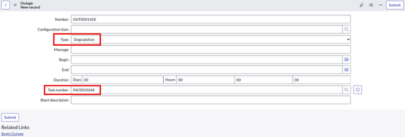<figcaption></figcaption></figure>

6. Click **Submit**
7. Click the **Update** button to return to the incidents list

Now, we need to switch scope to “**Platform AI Agents and Skills**”.

8. Click the Application Scope icon at the top of the page

<figure><figcaption></figcaption></figure>

9. Select **Application scope**: Global, and then filter for and select **Platform AI Agents and Skills.**


NOTE: If you can’t find the scope “Platform AI Agents and Skills”. Please click to check **Appendix Section A4: Application Scope at the end of the document.**


Now let’s go to **Flow Designer** and modify the existing “Get Similar records” action and have it return outages found in similar incidents as well.

10. Open Flow Designer (**All > Flow Designer**) - this will open Flow Designer in a new tab
11. Under the Actions tab, find “**Get Similar Records**” and open it. **DO NOT OPEN “Get Similar Incident Records”**

<figure>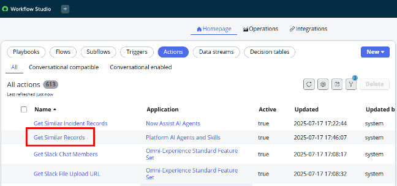<figcaption></figcaption></figure>

12. Copy the action by clicking on the three dots (...) in the top right of the page

<figure><figcaption></figcaption></figure>

13. Change the action name to “**\[Your initials] Get Similar Records and Outages”** and be sure that **“Platform AI Agents and Skills”** is the Application selected.

<figure><figcaption></figcaption></figure>

14. Click **Copy**
15. On the left, click S**cript Step**

<figure>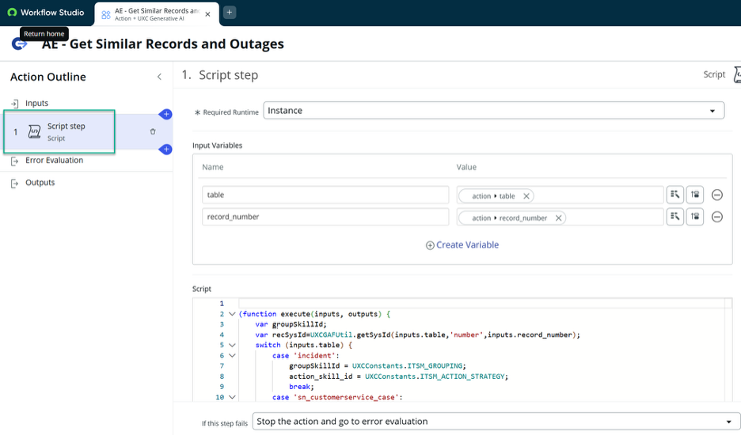<figcaption></figcaption></figure>

16. Please use the script text box below to copy/paste

```
(function execute(inputs, outputs) {
    var groupSkillId;
    var action_skill_id;
    var recSysId = UXCGAFUtil.getSysId(inputs.table, 'number', inputs.record_number);

    // Map the skills based on table
    var tableMapping = {
        'incident': { group: UXCConstants.ITSM_GROUPING, action: UXCConstants.ITSM_ACTION_STRATEGY },
        'sn_customerservice_case': { group: UXCConstants.CSM_GROUPING, action: UXCConstants.CSM_ACTION_STRATEGY },
        'sn_hr_core_case': { group: UXCConstants.HR_GROUPING, action: UXCConstants.HR_ACTION_STRATEGY }
    };

    var config = tableMapping[inputs.table];
    if (config) {
        groupSkillId = config.group;
        action_skill_id = config.action;
    }

    var grpSysId = UXCGAFUtil.getGroupSysId(recSysId, inputs.table, inputs.record_number, groupSkillId);
    var recs = grpSysId ? UXCGAFUtil.getGAFSimilarRecs(grpSysId, groupSkillId) : UXCGAFUtil.getRecReferences(inputs.table, recSysId);

    outputs.references = JSON.stringify(recs);
    
    // Extract IDs - Handling potential casing issue (sys_id vs sys_Id)
    var sysIds = [];
    if (Array.isArray(recs)) {
        recs.forEach(function(item) {
            var id = item.sys_id || item.sys_Id; 
            if (id) sysIds.push(id.toString());
        });
    }

    outputs.sys_ids = JSON.stringify(sysIds);

    if (sysIds.length === 0) {
        outputs.outage_details = "No related records found.";
        return;
    }

    // --- Optimized Outage Retrieval ---
    var reportLines = [];
    var outageGR = new GlideRecord('cmdb_ci_outage');
    outageGR.addQuery('task_number', 'IN', sysIds); // Batch query is much faster
    outageGR.orderBy('task_number');
    outageGR.query();

    var currentTask = "";
    while (outageGR.next()) {
        // Grouping header in the report
        if (currentTask != outageGR.task_number.getDisplayValue()) {
            currentTask = outageGR.task_number.getDisplayValue();
            reportLines.push("\n--- Outages for Task: " + currentTask + " ---");
        }

        reportLines.push("  ----------------------------------------");
        reportLines.push("  Outage: " + outageGR.getDisplayValue());
        reportLines.push("  Begin: " + outageGR.begin.getDisplayValue());
        reportLines.push("  End: " + outageGR.end.getDisplayValue());
        reportLines.push("  Description: " + (outageGR.description || "No description"));
        reportLines.push("  ----------------------------------------");
    }

    outputs.outage_details = reportLines.length > 0 ? reportLines.join('\n') : "No outages found for these records.";

})(inputs, outputs);
```

17. In the Output Variables window (below the Script window), delete both existing variables, and create the following:

<figure><figcaption></figcaption></figure>

18. On the left, click **Outputs**, then click **Edit Outputs**
19. Delete the message output (confirm the popup window)
20. Change the label from “References” to “similar records”
21. Click Create Output with the label “outage details”, the name “outage\_details”, and the type String

<figure>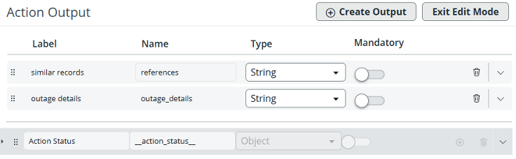<figcaption></figcaption></figure>

22. Click on **Exit Edit Mode**
23. Drag and drop the script step variables from the right into their corresponding boxes in the middle, like this:

<figure><figcaption></figcaption></figure>

24. Click **Test**
25. Type “incident” into the type field, and “**INC0010248**” into the record\_number field, then click **Run Test**
26. When it appears, click “Your test has finished running. View the Action execution details.”

Your results should look like:

<figure>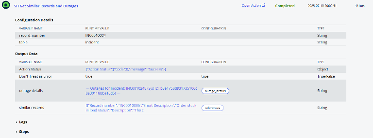<figcaption></figcaption></figure>

27. Return to the previous window, and click Save, then Publish
28. Close the Workflow Studio browser tab, and return to the main lab browser tab
29. Let’s change the Application Scope back to Global

<figure>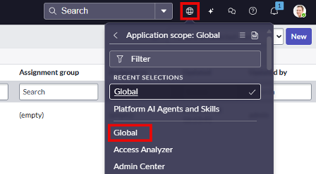<figcaption></figcaption></figure>

Now let’s create another Flow Action for creating an outage.

<br>

30. Open Flow Designer (All > Flow Designer) and search for “outage” under the Actions tab.

<figure>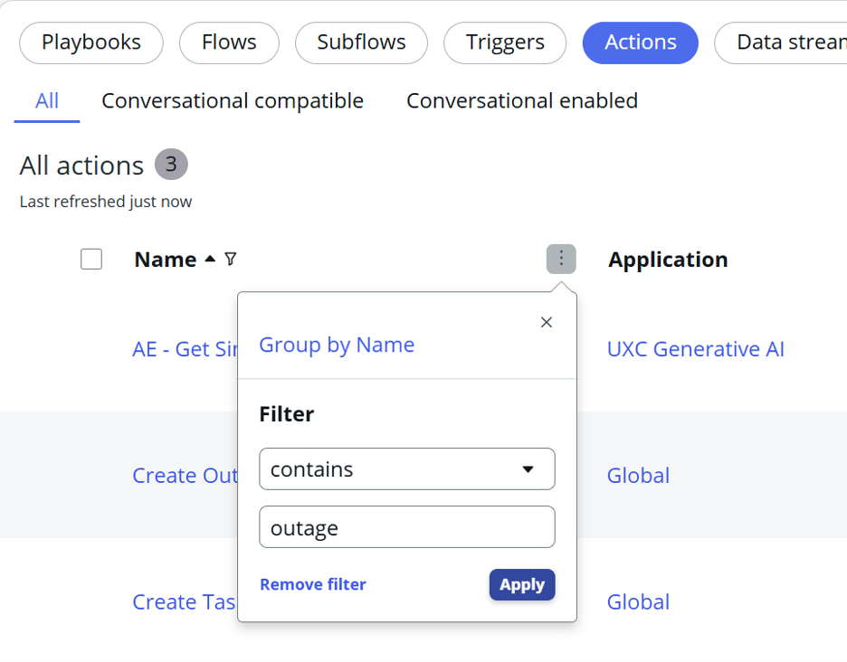<figcaption></figcaption></figure>

31\. Click on Create Outage and copy the action, name it “\[Your Initials] Create outage.”

<figure><figcaption></figcaption></figure>

32. Delete the following inputs:
    1. “configuration item”
    2. “type”
    3. “begin”

<figure>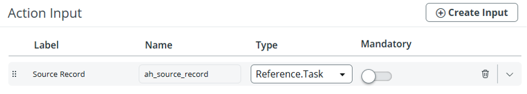<figcaption></figcaption></figure>

33. On the left, click **Script Step** and delete the following variables:
    1. “cmdbCI”
    2. “type”
    3. “begin”

<figure>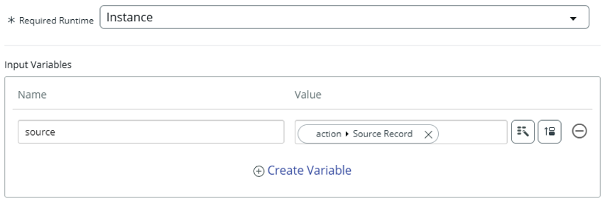<figcaption></figcaption></figure>

34\. Replace the existing script with this one:

```
(function execute(inputs, outputs) { 
  var parentTable = GlideDBObjectManager.get().getBase(inputs.source.getRecordClassName()); 
  var outage = new GlideRecord("cmdb_ci_outage"); 

  outage.initialize(); 
  //outage.setValue("cmdb_ci", inputs.cmdbCi); 
  outage.setValue("type", "Degradation"); 
  //outage.setValue("begin", inputs.begin); 
  outage.setValue("short_description", "degradation"); 
  if (parentTable == "task") 
    outage.setValue("task_number", inputs.source.getUniqueValue()); 
  outputs.OutageRecord = outage.insert(); 
  // Add this line to get the outage number as a string 
  outputs.outagerecordnumber = outage.getValue("number");  
})(inputs, outputs);
```

35. Then add an output variable with the following values:
    1. Label: “OutageRecordNumber”
    2. Name: outagerecordnumber
    3. Type: String
    4. Mandatory: True

<figure>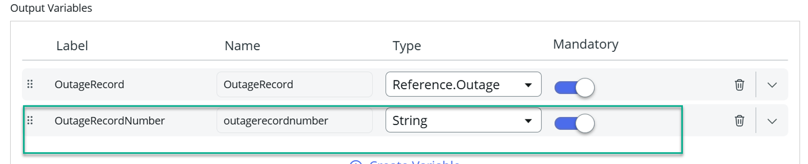<figcaption></figcaption></figure>

36. On the left, click Outputs, then Edit Outputs, then Create Output
37. Edit the new Output with the following values:
    1. Label: “Outage Number”
    2. Name: “outage\_number”
    3. Type: String

<figure><figcaption></figcaption></figure>

38. Click Exit Edit Mode
39. Drag the “OutageRecordNumber” Script variable to the Outage Number Action Output box.

<figure><figcaption></figcaption></figure>

40. Click Test
41. Select “INC0000001” as the Source Record, and click Run Test
42. When it appears, click “Your test has finished running. View the Action execution details.”

Your results should look like:

<figure><figcaption></figcaption></figure>

43. Return to the previous window, and click Save, then Publish
44. Close the Workflow Studio browser tab, and return to the main lab browser tab

**Section 2.4.2 - Extra - Build the AI Agent**

Now, let's open AI Agent Studio and build another AI agent. This time, we will duplicate the previously created AI agent “Incident Solution Recommender”.

1. Open AI Agent Studio (All > AI Agent Studio > Overview)
2. Click the Create and Manage module
3.  Click on the AI Agent tab, then select the "Incident Solution Recommender” and on the form, use the button at the top right to duplicate the agent

    <div align="left"><figure><figcaption></figcaption></figure></div>
4. Click Duplicate when prompted
5. Update the fields with the following values:
   1. Name: “Incident Solution Recommender with Outage Check”
   2. Instructions (include the numbering):

```
1. Get details of an incident.
2. Get current similar incidents. The table name is "incident".
3. Using the incident's short description, search the Knowledge Base for relevant articles.
4. Based on the similar incidents' details, the kb articles returned, and the outages found in similar incidents, add resolution steps, along with any relevant similar incidents, knowledge articles, and outages found in similar incidents, to the Additional Comments section of the incident record. When adding a comment, make sure to include a qualifier that states the comment was added by an AI Agent. Your output message to the user should be formatted to be easy to read with new line characters in a list format. Also provide your reasoning for recommending these steps.
5. If outages are found in similar incidents, ask the user if they want to create an outage for the current incident being resolved. If no outages exist in similar incidents, do not mention anything back to the user.
6. If an outage record was created successfully, please add the outage number to the Additional Comments section of the incident record.
7. End.
```

6. Click Save and continue
7. Click on the existing “Get Similar Incident Records” flow action and change the name to “Get Similar Incident Records and Outages”
8. Select “\[Your Initials] Get Similar Records and Outages” as the flow action.

<figure><figcaption></figcaption></figure>

9. Click **Save**
10. Click the Add tool dropdown list, and select Flow action, then complete the fields with the following information:
    1. Name: “Create Outage”
    2. Description: “Create an outage for the task/record being resolved”
    3. Flow action: \[Your initials] Create Outage
    4. Execution mode: Autonomous
    5. Display output: Yes
    6. Output Transformation strategy: Concise.

11\. Click Add-Your tools should look like this:

<figure>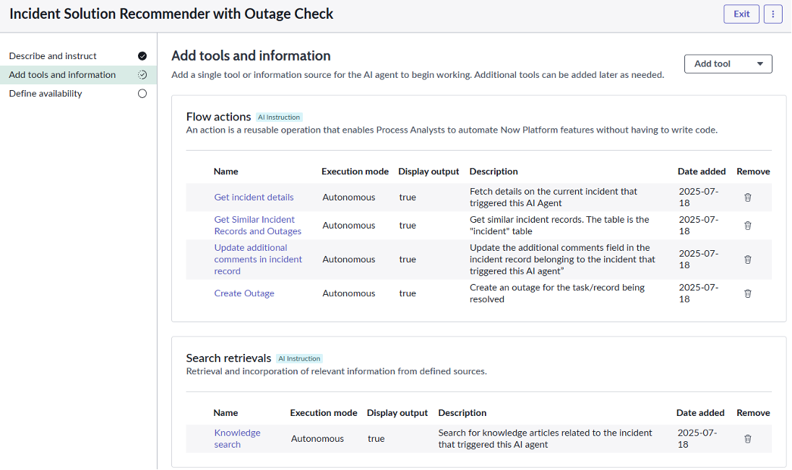<figcaption></figcaption></figure>

12\. Click **Save and Continue**

13\. On the Define Availability page, make sure the Status toggle is set to On

14\. Click **Save and Test**

**Now let’s test the agent!**

· In the Task box enter “INC0010004” and click Start test.

· At the end of the test, check the comments in INC0010004:

<figure>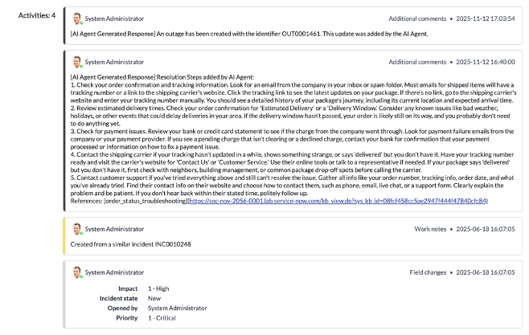<figcaption></figcaption></figure>

Congratulations! You have completed the advanced part of the lab!
