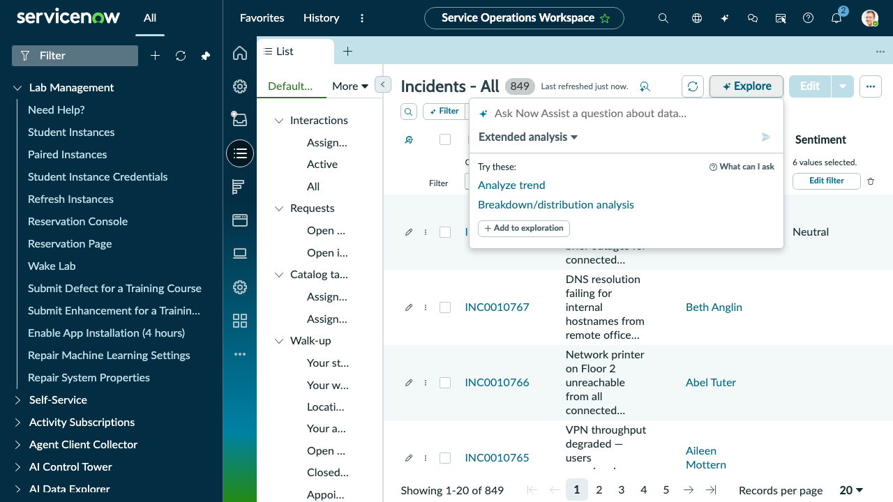
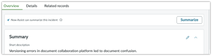
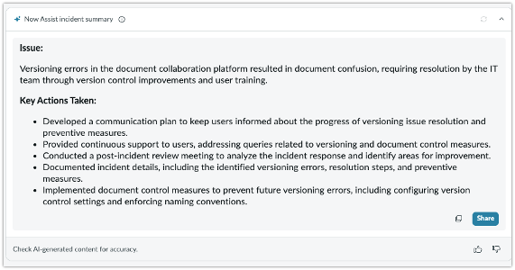
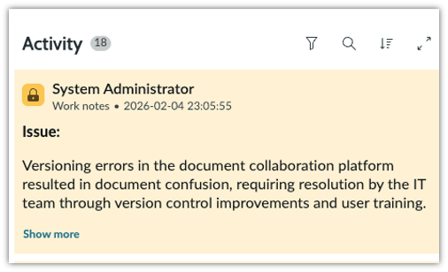

# Section 3.1 Incident Summarization

1. Please return to your lab instance by clicking on the ServiceNow logo in the upper-left corner. Alternatively, y**ou can remove any portal suffix from your instance URL**; for example, my URL looks like this.

<figure><figcaption></figcaption></figure>

2. **Select the Workspace tab** and **select Service Operations Workspace.** Service Operations Workspace provides a consolidated view to help agents manage the life cycles of task records, such as incidents, requests, and walk-ups.

<figure><figcaption></figcaption></figure>

3. Let’s get to know Service Operations Workspace a little. We are going to search for a specific incident to work with. First, select list view, and then under incidents, select All to get a list of incidents.

<figure><figcaption></figcaption></figure>

4. In that list view, select the **“+ Explore”** button (tooltip “Explore with AI”) near the top-right of the list toolbar — this is the Gen-AI feature; the plain “Filter” button next to it is just the traditional filter-condition builder and has no AI input.

<figure><figcaption></figcaption></figure>

5. This opens a small floating panel with an **“Ask Now Assist a question about data…”** input. **Select and copy the following** into that input and submit it:

> Any incident that has a description that contains Versioning errors

Unlike the old Filter-based flow, this doesn’t filter the underlying list — Now Assist answers directly inside the panel, naming the matching incident(s) by number. Your incident number may differ from the one shown here — at time of writing, this returned **INC0010017** (“CI/CD pipeline throwing versioning errors after library upgrade”).

6. Take note of the incident number from the AI’s answer, then open that record using the global search bar at the top of the page (type the incident number and select the exact match) — the list behind the panel is unchanged, so you won’t find it by scrolling the grid.

<figure><figcaption></figcaption></figure>

7. Select the **Summarize button** to use Generative AI to summarize the incident.

<figure><figcaption></figcaption></figure>

The summarization skill analyzes the short description, description, work notes, and related records before generating the issue, SLAs, impacted services, and actions taken up to that point.

As an agent, this is extremely helpful if there are multiple updates to the work notes and the text is dense; when a ticket is assigned to the agent, the Agent must spend 15 minutes reading all the work notes. Instead, they can quickly read the Now Assist summarization.

<figure><figcaption></figcaption></figure>


Your incident summarization may look slightly different from the screenshot shown below.


8. Notice the different icons at the bottom. The thumbs up/down are used to send feedback during re-training of the Now LLM (if the customer has opted into data sharing). You can copy the text to a clipboard as well as regenerate the summary.
9. Let's add the generated summary to our work notes by **selecting the Share button.**

<figure><figcaption></figcaption></figure>

10. **Edit the summary by adding a bulleted item** like the one below and then select **Save to work notes**.


If the customer has opted in for data sharing, then the edits to the generated response are also sent to the Now LLM for fine-tuning


11. Expand the work note activity stream to see that your edits were copied

<figure><figcaption></figcaption></figure>


Bonus: Return to the Incident list and try the summarization skill with ANY in-progress incident. Try it a few times!


**Congratulations**, you have created an incident summary and posted it to the work notes! Please don't close the Service Operations workspace or the incident tab; we will use it in the next section
