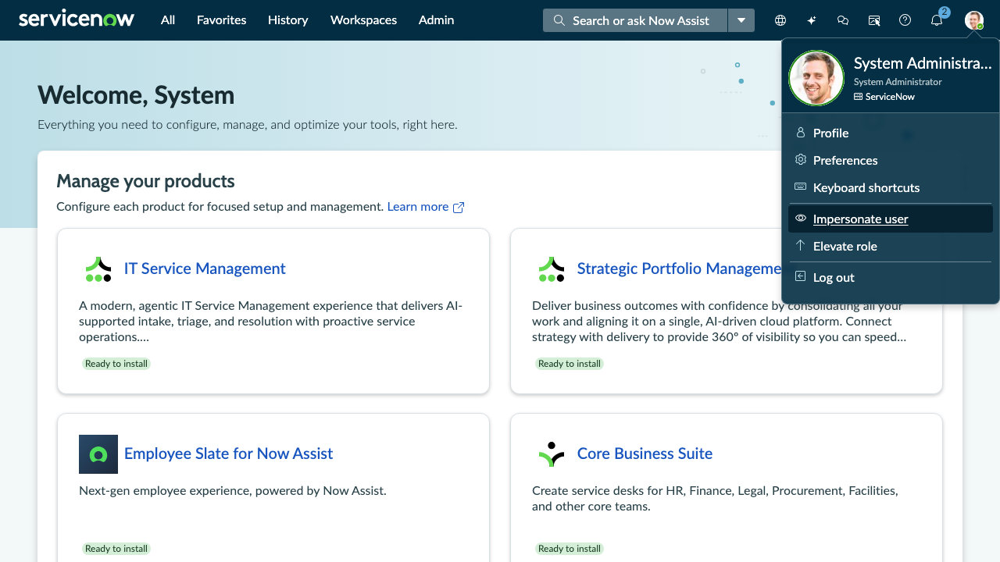
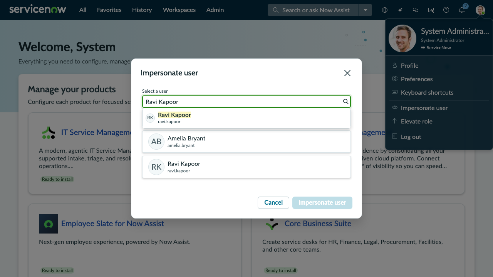
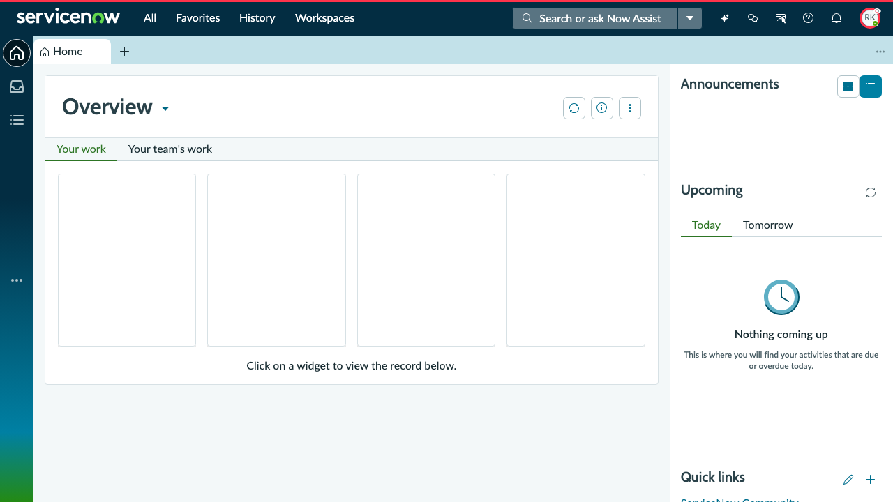

# Section 3.1 Incident Summarization


**Persona for this section:** Sections 3.1-3.5 are written from the perspective of an IT agent, not an administrator. Before starting, impersonate **Ravi Kapoor** (one of the IT agent personas seeded on this lab instance) so that what you see matches an agent's real day-to-day access — not the unrestricted admin view.

1. Select your user icon in the top-right corner, then select **Impersonate user**.



2. Search for and select **Ravi Kapoor**, then select **Impersonate user** to confirm.



You'll know it worked when your user icon in the top-right shows "RK" and a banner confirms you're impersonating Ravi Kapoor.



Stay impersonated as Ravi Kapoor through the end of Section 3 (Section 3.5) — you'll switch personas again for Section 5.


1. Once you impersonate **Ravi Kapoor** Service Operations Workspace is the homepage. Refresh the page once you land there after Impersonating, otherwise you probably won't see any data the page.&#x20;

<figure><figcaption></figcaption></figure>

2. Make sure to click on the **In Progress** donut on the left side
3. Let’s get to know **Service Operations Workspace** a little. We are going to search for a specific incident to work with. First, select the list view, then under incidents, select All to see a list of incidents.
4. In that list view, select the **“+ Explore”** button (tooltip “Explore with AI”) near the top-right of the list toolbar — this is the Gen-AI feature; the plain “Filter” button next to it is just the traditional filter-condition builder and has no AI input.

<figure><figcaption><p>Confirmed live as Ravi Kapoor — the "Explore with AI" button.</p></figcaption></figure>

5. This opens a small floating panel with an **“Ask Now Assist a question about data…”** input. **Select and copy the following** into that input and submit it:


```
Any incident that has a description that contains Versioning errors
```


<figure><figcaption></figcaption></figure>

6. Close that window and then Click on **Show different distribution**

<figure><figcaption></figcaption></figure>

6. Now you can scroll through even more detailed analysis of the unassigned incidents and breakdown, which may further help Ravi prioritize his work&#x20;

<figure><figcaption></figcaption></figure>

7. Let's go BACK to the In progress donut, and select and open **INC0010005 "Blocked: Password reset portal....**

<figure><figcaption></figcaption></figure>

Once that is open, click the Generate button in the AI Summary area

<figure><figcaption></figcaption></figure>

The summarization skill analyzes the short description, description, work notes, and related records before generating the issue, SLAs, impacted services, and actions taken up to that point.

<figure><figcaption></figcaption></figure>

As an agent, this is extremely helpful if there are multiple updates to the work notes and the text is dense; when a ticket is assigned to the agent, the Agent must spend 15 minutes reading all the work notes. Instead, they can quickly read the Now Assist summarization.


Your incident summarization may look slightly different from the screenshot shown above


8. Notice the icons at the bottom. As well ask '**Ask Now Assist to...** that will open the Now Assist Panel and kick on the ability to call any Now Assist Agentic workflows. You can also copy the text to the clipboard and regenerate the summary.
9. **Edit the summary by adding a bulleted item** like the one below and then select **Save to work notes**.
10. Expand the work note activity stream to see that your edits were copied


Bonus: Return to the Incident list and try the summarization skill with ANY in-progress incident. Try it a few times!


**Congratulations**, you have created an incident summary! Please don't close the Service Operations workspace or the incident tab; we will use it in the next section
