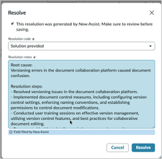

# Section 3.2 Resolution Note Generation

1. Within Service Operations Workspace, **return** to the incident from Section 3.1 with the short description, "Versioning…"
2. In the upper-right corner of the incident, locate the **Resolve button** on the right side. Click it — Now Assist immediately reviews the work notes for the current ticket and auto-generates **both** a resolution code **and** resolution notes in the Resolve pop-up window, with no extra click needed.

<figure><figcaption></figcaption></figure>

3. The resolution code defaults to **“Solved (Permanently)”** rather than “Solution provided” (that option is still available in the drop-down if you'd rather use it — just select it before saving). Review the auto-generated resolution notes.
4. Click “**Resolve**” to save it to the ticket.

<figure><figcaption></figcaption></figure>

5. **Select the details tab** of the Incident. Notice that the resolution was copied to the Resolution notes field, and the state of the ticket went from New to Resolved.


Bonus: Return to the Incident list and try resolving ANY in-progress incident — Now Assist generates the resolution code and notes automatically as soon as you click Resolve.


&#x20;Congratulations, you have generated resolution notes and resolved an incident! Please **don't close** your browser or incident tab; we will use it in the next section.
