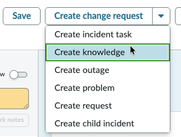
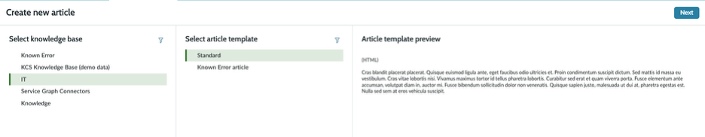
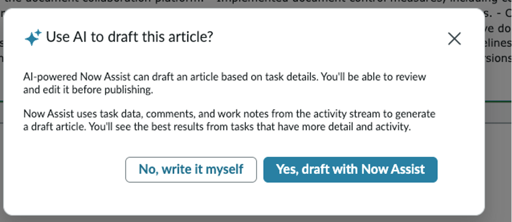

# Section 3.3 Knowledge Creation

1. On the same “Versioning….” Incident, let's create a Knowledge article. In the upper right corner of the incident, locate the drop-down menu and click "**Create Knowledge**."

<figure><figcaption></figcaption></figure>


Tip: In this lab, the Generate Knowledge skill is only available when the incident is in a “Resolved” or “Closed” state. Availability filters can be updated to fit your processes.


2. A related record will be created, and the Create New Article template will appear. Select “IT” under Select Knowledge Base, choose ‘Standard' under Select Article Template, then click “**Next**.”

<figure><figcaption></figcaption></figure>

3. Then an AI draft article pop-up appears; click “Y**es, draft with Now Assist.**"

<figure><figcaption></figcaption></figure>

4. Review the article body.  How closely does it match the details in the Incident?

<figure><figcaption></figcaption></figure>

**Congratulations,** you have created a knowledge article!  Please **don’t close** your browser or the workspace; we’ll continue exploring it in the next section. 
