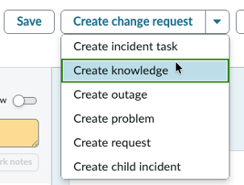
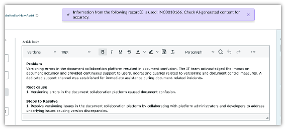

# Section 3.3 Knowledge Creation

1. On the same “Versioning….” Incident, let's create a Knowledge article. In the upper right corner of the incident, locate the drop-down menu and click "**Create Knowledge**."

<figure><figcaption></figcaption></figure>


Tip: In this lab, the Generate Knowledge skill is only available when the incident is in a “Resolved” or “Closed” state. Availability filters can be updated to fit your processes.


2. A related record will be created, and the Create New Article template will appear. Select “Knowledge” under Select Knowledge Base, choose ‘Standard' under Select Article Template, then click “**Next**.”

<figure><figcaption></figcaption></figure>

3.  There is a bug currently in Now Assist for KB,&#x20;

    1. **Steps to Resolve**

    Step 1: On the resolved incident, click 'Create Knowledge'. The new 'Create New Knowledge' page will open. Pick **Knowledge** and **Standard** under KB, and&#x20;

<figure><figcaption></figcaption></figure>

A knowledge screen will appear. \
Step 2: On the right side of the editor, click the **trash/bin icon (tooltip: 'Clear canvas'**). This clears the canvas so the AI can write fresh content.\
Step 3: At the bottom of the canvas, you will see a prompt that says '**Write about \<incident number>**'. Make sure 'Source' is set to 'Incidents' and 'Language' is set to 'English'.\
Step 4: Click the arrow (send) icon at the right of that prompt. Now Assist will generate the knowledge article for you using the incident details.\
Step 5: Review the draft, edit if needed, and Save / Publish.

4. Review the article body. How closely does it match the details in the Incident?

<figure><figcaption></figcaption></figure>

**Congratulations,** you have created a knowledge article! Please **don’t close** your browser or the workspace; we’ll continue exploring it in the next section. 
