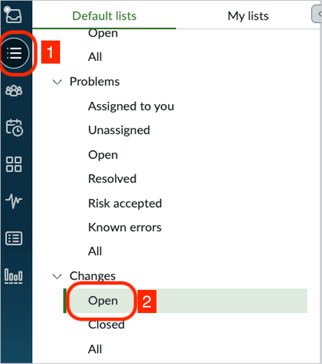

# Section 3.4 Change Summarization

1. Select list view, then scroll down to “**Changes”**.  Select “**Open**” to get a list of all open Change Records.

&#x20;

<figure><figcaption></figcaption></figure>

&#x20;

2. From the list of open **Changes**, locate and click on “**CHG0044021**”.

<figure><figcaption></figcaption></figure>

3. Select the “**Summarize**’ button on the Overview to see the Summary of the Change Request.

<figure><figcaption></figcaption></figure>

**Congratulations,** you have generated your first change summarization!  Please **don’t close** your browser or the workspace; we’ll continue exploring it in the next section.
