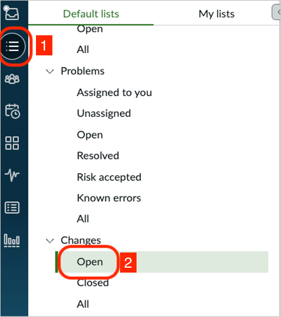

# Section 3.4 Change Summarization

1. Select list view, then scroll down to “**Changes”**. Select “**Open**” to get a list of all open Change Records.

<figure><figcaption></figcaption></figure>

2. From the list of open **Changes**, locate and click on “**CHG0030006**”. \[PLATFORM-RELEASE-24.1.2] Quarterly Platform Release Train......

<figure><figcaption></figcaption></figure>

3. For our lab, let's move this change along a bit. Click on Request approval 

4. Select the “**Summarize**’ button on the Overview to see the Summary of the Change Request.

<figure><figcaption></figcaption></figure>

**Congratulations,** you have generated your first change summarization! Please **don’t close** your browser or the workspace; we’ll continue exploring it in the next section.
