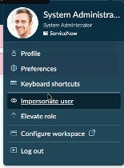
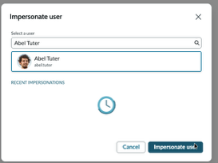
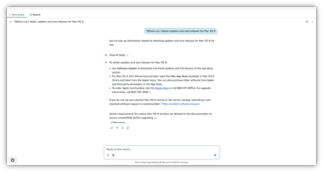

# Section 4.1 Superpowered Search

1. IMPORTANT: Select the profile picture in the upper right-hand corner and impersonate a user: Abel Tuter.  The window will reload.

&#x20;

<figure><figcaption></figcaption></figure> <figure><figcaption></figcaption></figure>

2\.    Next, open the employee center by navigating to A**ll > Self-Service > Employee Center.**  Alternatively, in your browser’s address bar, append “**/esc**” to the end of the instance URL.  For example:

<figure><figcaption></figcaption></figure>

3\.    In the search box, type and then hit Enter

> Where can I obtain updates and new releases for Mac OS X

&#x20;

 

&#x20;

Notice how the Search now expands in a full-screen enhanced view, which will Now Assist users with AI Search to pull the top-ranked knowledge article, then sends it to the Now LLM to generate an answer to the original question. This is a huge time-saver, as employees only need to read part of the knowledge article; we use Now LLM to provide a succinct answer.

&#x20;

<figure><figcaption></figcaption></figure>

 

Notice that when you click the thumbs-up or thumbs-down buttons, feedback is sent to the Now LLM (if the customer has not opted out of data sharing).


Dive Deeper:  ServiceNow uses a Retrieval Augmented Generation (RAG) architecture that puts a semantic search engine before an LLM.  If you want to get into the details of the architecture, check out the excellent article by Sean Hughes, ["Under the Hood: Now Assist in AI Search"](https://www.servicenow.com/community/now-assist-articles/under-the-hood-now-assist-in-ai-search/ta-p/2642915).


**Congratulations!** You have finished reviewing Now Assist for Search. Let's move on to the next section. Now pivot in the same enhanced chat view into a Now Assistant Virtual Agent conversation.
