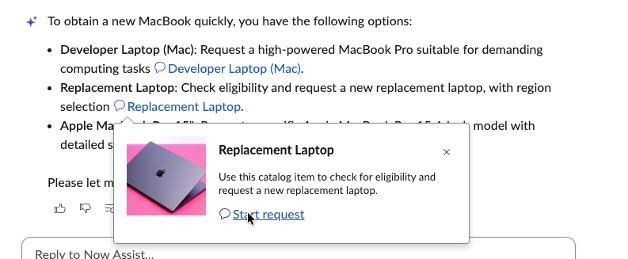

# Section 4.2 Now Assist for the Virtual Agent

Before we test out Now Assist for Virtual Agent, let's pause for a quick history lesson:

All chatbots – including ServiceNow's Virtual Agent (VA) – require some development. VA provides out-of-the-box conversations to reduce development, but customers must still use developers to modify them to suit their unique needs.

Generative AI changed all that. If a user's request could be answered by a knowledge article or a catalog item (in many cases, up to 70% of incidents/cases fall into this category), then Now Assist in VA would dynamically generate the conversation – NO DEVELOPMENT needed. This is huge, and you're about to see why.

1. In the same enhanced screen, let’s ask a new question

<figure><figcaption></figcaption></figure>


Tip: If you can’t see the VA icon, you’re probably not in the Employee Center. Double-check that you’re using the correct URL!


2. **Copy and paste** the following into the Now Assist window and **hit enter**

> &#x20;What are my current assets?

<figure><figcaption></figcaption></figure>

3. Now, **copy and paste** the following and **hit enter**:

> I a need a new macbook ASAP, I have a critical meeting in 2 days

<figure><figcaption></figcaption></figure>

<figure><figcaption></figcaption></figure>

Note how Now Assist switches tracks and follows the change in conversation. Hover over the Replacement laptop option and c**lick Start Request**, then respond to the questions as needed.

<figure><figcaption></figcaption></figure>

4. &#x20;Next, **copy and paste** the following and **hit enter**

> &#x20;How do I connect to VPN?

<figure><figcaption></figcaption></figure>

Because the Admin's assets are recorded in ServiceNow, Now Assist knows that Abel has a Mac and provides the appropriate instructions. Also, easily pivoting from question to question.

**Congratulations,** you have tested search, engaged in a multi-turn conversation with Now Assist, and even ordered a replacement laptop.  You have completed this section!&#x20;

 
