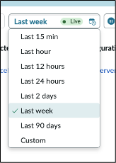

# Section 5.1 Alert Express list

The operator is a person who reviews alerts to identify issues, assess their impact, and determine how to resolve them. In this section, you will act as an operator. Since this lab focuses on Now Assist, we will not go into detail about other actions an operator might take within AIOps, but only how Now Assist can help analyze alerts. As an operator, you can return to the Service Operations Workspace through the workspace menu. The operator views and manages alerts in the Express List, which is a view within the Service Operations Workspace.&#x20;

1. Close any popups that appear when you first login and then open the **Express List** on the left navigation bar (the second icon from the bottom).

&#x20;

<figure><figcaption></figcaption></figure>

&#x20;

2. Close the pop-up window that appears.

Typically, an operator would see alerts reported by monitoring tools in the Express List in near real-time. For this lab, alerts have been captured and pre-loaded onto your instance. Because of this, the alert times might not be recent enough to appear in the default window, so let’s expand the window.

&#x20;

3. &#x20;In the upper-right corner of the Express List, click the dropdown labeled **Last week**. This will display all alerts received by the system.

<figure><figcaption></figcaption></figure>

4\.    The Express List should now show more alerts and some alert groups.&#x20;

<figure><figcaption></figcaption></figure>

**But first, a quick sidebar…**

> What are alerts? In ServiceNow, the raw payloads from monitoring tools are called events. Many of these events are just noise, meaning they include information that an operator wouldn't act on. These could be informational events, ones that haven’t met a specific threshold, or haven’t occurred enough times to be concerning. These noisy events can be ignored, and ServiceNow can reduce the noise by never displaying those events to the operator.
>
> \
> Events that are important enough for an operator to investigate and act against are called alerts.  The Express List shows alerts to the operator. 
>
> There are times when alerts are related to each other.  For example, if there is a web server that is timing out on connections because the server it is hosted on is out of memory or compute resources, there may be alerts coming in against both the web server for those transaction failures and the host system generating its own alert about running out of memory or compute resources.
>
> \
> In the Express List, alert groups are identified by a circled number next to the alert number. To view other alerts within the group, click the arrow on the left side of the primary alert's number.

Let's focus on the Alert Analysis, transforming potentially obscure machine-generated output into clear, natural language. Code to text! 

 
