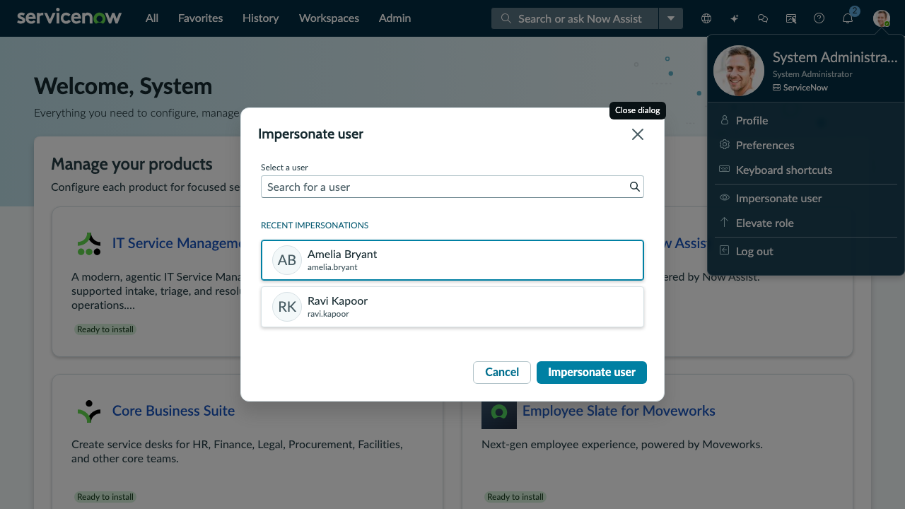
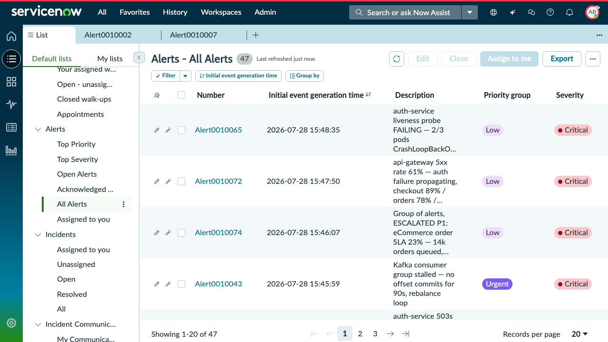
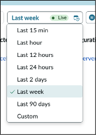
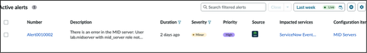

# Section 5.1 Alert Express list


**Persona for this section:** Sections 5.1-5.2 are written from the perspective of an IT Ops operator, not an administrator. Before starting, impersonate **Amelia Bryant** (the ITOM engineer persona seeded on this lab instance).

1. Select your user icon in the top-right corner, then select **Impersonate user**.
2. Search for and select **Amelia Bryant**, then select **Impersonate user** to confirm.

<figure><figcaption></figcaption></figure>

You'll know it worked when your user icon in the top-right shows "AB" and a banner confirms you're impersonating Amelia Bryant.

Stay impersonated as Amelia Bryant through the end of Section 5 (Section 5.2).


The operator is a person who reviews alerts to identify issues, assess their impact, and determine how to resolve them. In this section, you will act as an operator. Since this lab focuses on Now Assist, we will not go into detail about other actions an operator might take within AIOps, but only how Now Assist can help analyze alerts. As an operator, you can return to the Service Operations Workspace through the workspace menu. The operator views and manages alerts through the **List** module within the Service Operations Workspace.


Note: earlier versions of this lab referenced an "Express List" icon in the left navigation rail. That icon is still present on this platform version, live-confirmed under Amelia Bryant's ITOM role set — it's simply a separate view of the same alert data alongside the List module described below. Either one works for this section; we use the List module below since its navigation is more predictable across role sets.


1. Close any popups that appear when you first login. The left navigation rail in Service Operations Workspace now shows, top to bottom: Home, AIOps configuration, Inbox, **List**, Insights, Applications, Devices, DEX Administration, Service Dashboard, and an overflow "**...**" menu.

<figure><figcaption></figcaption></figure>

2. Click the **List** icon. In its sidebar, find the **Alerts** category and select **All Alerts** (other entries here include Top Priority, Top Severity, Open Alerts, Acknowledged Alerts, and Assigned to you).
3. Close the pop-up window that appears, if any.

<figure><figcaption>
Confirmed live as Amelia Bryant.
</figcaption></figure>

Typically, an operator would see alerts reported by monitoring tools in the list in near real-time. For this lab, alerts have been captured and pre-loaded onto your instance. Because of this, the alert times might not be recent enough to appear in the default window, so let’s expand the window.

4. In the upper-right corner of the list, click the dropdown labeled **Last week**. This will display all alerts received by the system.

<figure><figcaption></figcaption></figure>

5\.    The list should now show more alerts and some alert groups.&#x20;

<figure><figcaption></figcaption></figure>

**But first, a quick sidebar…**

> What are alerts? In ServiceNow, the raw payloads from monitoring tools are called events. Many of these events are just noise, meaning they include information that an operator wouldn't act on. These could be informational events, ones that haven’t met a specific threshold, or haven’t occurred enough times to be concerning. These noisy events can be ignored, and ServiceNow can reduce the noise by never displaying those events to the operator.
>
> \
> Events that are important enough for an operator to investigate and act against are called alerts.  The Alerts list shows alerts to the operator. 
>
> There are times when alerts are related to each other.  For example, if there is a web server that is timing out on connections because the server it is hosted on is out of memory or compute resources, there may be alerts coming in against both the web server for those transaction failures and the host system generating its own alert about running out of memory or compute resources.
>
> \
> In the Alerts list, alert groups are identified by a circled number next to the alert number. To view other alerts within the group, click the arrow on the left side of the primary alert's number.

Let's focus on the Alert Analysis, transforming potentially obscure machine-generated output into clear, natural language. Code to text! 

 
