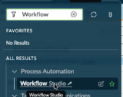
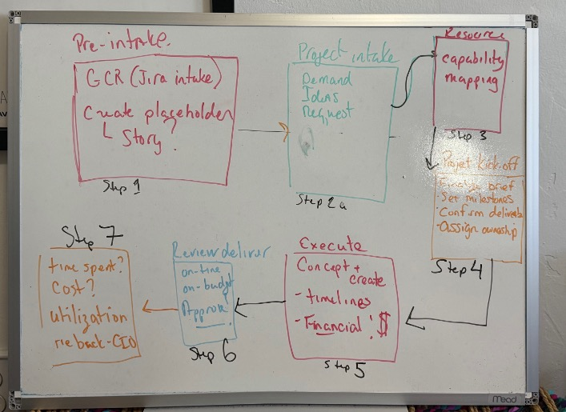
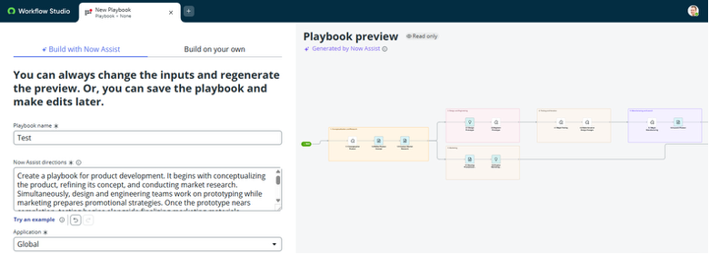

# Section 6.1 Playbook Generation

Everyone in the room has probably drawn a brilliant flow on a whiteboard and then had to figure out how to get this into ServiceNow.

1. **Open Workflow Studio (All > Process Automation > Workflow Studio).** The ServiceNow platform uses workflows to orchestrate process steps and integrate them into systems; Flow Designer is used to build out those workflows.

<figure><figcaption></figcaption></figure>

2. Flow Designer will open in a new tab. On the far right, click the **“New**” button. From the dropdown menu, select “**Playbook**”

<figure><figcaption></figcaption></figure>

3. Copy and paste the following TEXT into the description

> > _Step 1 — Pre-Intake (GCR-Creative)_\
> > &#xNAN;_• Review the upcoming GCR roadmap to identify expected creative needs._
> >
> > _• Create placeholder projects for resource and skill forecasting._
> >
> > _Step 2 - Project Intake (Requestors)_
> >
> > _• Creative requests submitted via the Parent GCR intake system (Jira)._
> >
> > _• Each Jira ticket generates a linked Jira Child ticket for GCR Creative's workflow._
> >
> > _Step 3 - Resource Review (Creative Leads)_
> >
> > _• Weekly review of capacity and assign resources by skill, role, and availability._
> >
> > _Step 4 — Project Kick-Off (Creative Leads & Team Members)_
> >
> > _• Finalize the creative brief, set milestones, confirm deliverables, and assign ownership.4._
> >
> > _Step 5 - Concept & Create (Creative Team Members)_
> >
> > _• Execute tasks in alignment with the agreed timelines and quality standards._
> >
> > _Step 6 - Review & Delivery (Creative Leads)_
> >
> > _• Review, approve, and deliver assets._
> >
> > _Step 7 - Reporting & Finance Tracking (Creative Leads, Managers & Finance/Operations)_
> >
> > _• Capture time spent, cost, and resource utilization data._
> >
> > _• Link spend to specific initiatives, reconcile with finance systems, and update stakeholders_
>
> _._

4. First, download this image:

<figure><figcaption></figcaption></figure>



5. Enter a Flow name in the ‘Attach an Image section, select the file you just downloaded, then click “**Generate flow preview”**.

<figure><figcaption></figcaption></figure>

6. Take a closer look at the resultant flow! You have a huge jumpstart on the playbook development with help from Now Assist for Creator. When you are finished, **click Discard playbook.**

<figure><figcaption></figcaption></figure>
