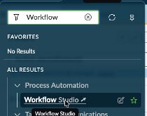
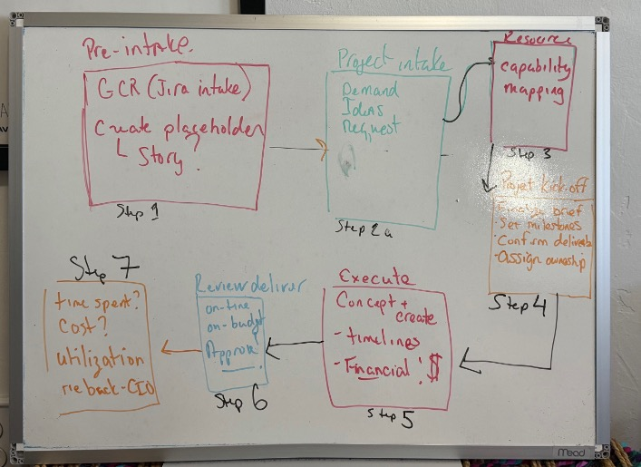
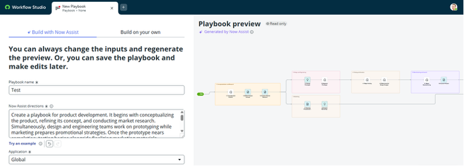

# Section 5.1 Playbook Generation

Everyone in the room has probably drawn a brilliant flow on a whiteboard and then had to figure out how to get this into ServiceNow.

1. **Open Workflow Studio (All > Process Automation > Workflow Studio).** The ServiceNow platform uses workflows to orchestrate process steps and integrate them into systems; Flow Designer is used to build out those workflows.

<figure><figcaption></figcaption></figure>

2. Flow Designer will open in a new tab. On the far right, click the **“New**” button. From the dropdown menu, select “**Playbook**”

<figure><figcaption></figcaption></figure>

3. First, let's try with TEXT ONLY . Copy and paste the following TEXT into the description below after choosing instructions ONLY and Execution type of 'Standalone'.
4. &#x20;Click 'Generate Playbook preview" in the bottom right

<figure><figcaption></figcaption></figure>

<figure><figcaption></figcaption></figure>


```

Step 1 — Pre-Intake (GCR-Creative)
&#xNAN;• Review the upcoming GCR roadmap to identify expected creative needs.
• Create placeholder projects for resource and skill forecasting.
Step 2 - Project Intake (Requestors)
• Creative requests submitted via the Parent GCR intake system (Jira).
• Each Jira ticket generates a linked Jira Child ticket for GCR Creative's workflow.
Step 3 - Resource Review (Creative Leads)
• Weekly review of capacity and assign resources by skill, role, and availability.
Step 4 — Project Kick-Off (Creative Leads & Team Members)
• Finalize the creative brief, set milestones, confirm deliverables, and assign ownership.4.
Step 5 - Concept & Create (Creative Team Members)
• Execute tasks in alignment with the agreed timelines and quality standards.
Step 6 - Review & Delivery (Creative Leads)
• Review, approve, and deliver assets.
Step 7 - Reporting & Finance Tracking (Creative Leads, Managers & Finance/Operations)
• Capture time spent, cost, and resource utilization data.
• Link spend to specific initiatives, reconcile with finance systems, and update stakeholders
```


4. In about 15-30 seconds, you should see this

<figure><figcaption></figcaption></figure>

4. Now let's try an image, or click the plus and choose "flow.

<figure><figcaption></figcaption></figure>

4. Repeat the steps, and choose 'image' to describe the playbook

,&#x20;

4. Download this image from below and attach it, then hit **'Generate Flow preview'** again

<figure><figcaption></figcaption></figure>



5. Enter a Flow name in the ‘Attach an Image section, select the file you just downloaded, then click “**Generate flow preview”**.

<figure><figcaption></figcaption></figure>

6. Take a closer look at the resultant flow! You have a huge jumpstart on the playbook development with help from Now Assist for Creator. When you are finished, **click Discard playbook.**

<figure><figcaption></figcaption></figure>
