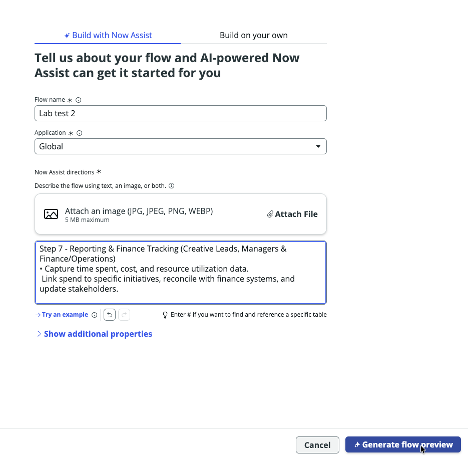
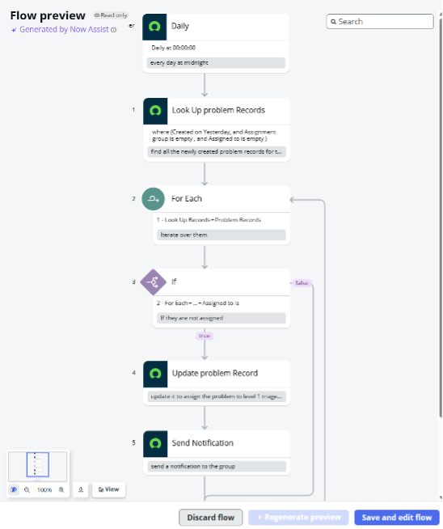
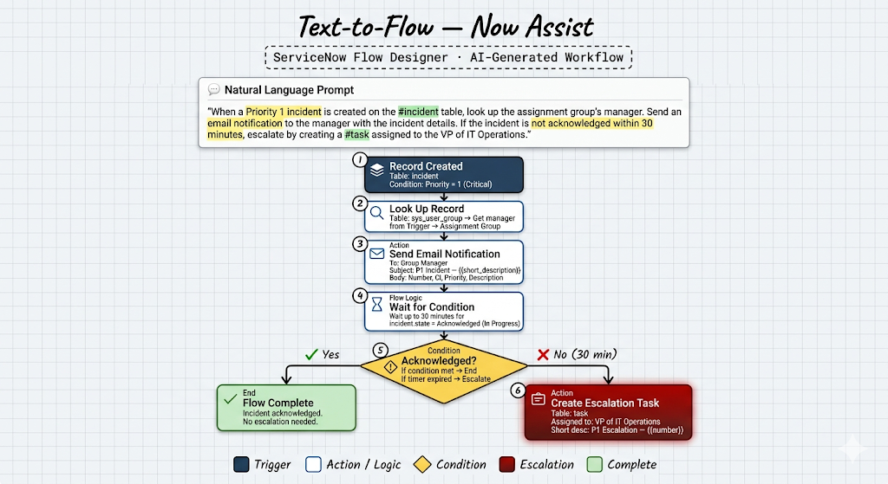

# Section 6.2 Flow Generation

Now let's create a flow with based on a prompt along with an image.

#### Generate Flow from Text

1. You should be back in the Workflow Studio tab.  This time, select **New > Flow.**

<figure><figcaption></figcaption></figure>

2. Copy and past this into the “Now Assist Directions give the flow a name, and hit Generate flow preview.&#x20;

```
Brand new process in place for next week
Step 1 — Pre-Intake (GCR-Creative)
Review the upcoming GCR roadmap to identify expected creative needs.
• Create placeholder projects for resource and skill forecasting.
Step 2 - Project Intake (Requestors)
• Creative requests submitted via the Parent GCR intake system (Jira).
• Each Jira ticket generates a linked Jira Child ticket for GCR Creative's workflow.
Step 3 - Resource Review (Creative Leads)
• Weekly review of capacity and assign resources by skill, role, and availability.
Step 4 — Project Kick-Off (Creative Leads & Team Members)
• Finalize the creative brief, set milestones, confirm deliverables, and assign ownership.
Step 5 - Concept & Create (Creative Team Members)
• Execute tasks in alignment with the agreed timelines and quality standards.
Step 6 - Review & Delivery (Creative Leads)
• Review, approve, and deliver assets.
Step 7 - Reporting & Finance Tracking (Creative Leads, Managers & Finance/Operations)
• Capture time spent, cost, and resource utilization data.
Link spend to specific initiatives, reconcile with finance systems, and update stakeholder  
```

3. &#x20;Review the proposed flow.  Does it follow the directions laid out by the Now Assist prompt?

<figure><figcaption></figcaption></figure>

4. When you are finished, click **Discard flow.**

<figure><figcaption></figcaption></figure>

#### Generate Flow from Image

1. First, download this image:&#x20;

<figure><figcaption></figcaption></figure>



2. You should be back in the Workflow Studio tab.  This time, select **New > Flow.**     &#x20;

<figure><figcaption></figcaption></figure>

2. Provide a name of your new flow and upload the image:

<figure><figcaption></figcaption></figure>

4. Click **Generate flow preview** and let Now Assist create a flow from the image!


Note: If the generation fails the first time, please attempt it again.&#x20;


5. Review the Flow preview on the right hand side. Did Now Assist pick up the logic required from the image?

<figure><figcaption></figcaption></figure>

5. Feel free to Discard flow, or Save and edit flow to review the AI-generated flow further.&#x20;
6. Once complete, **close the Workflow Studio tab.**

<p align="center"> </p>
