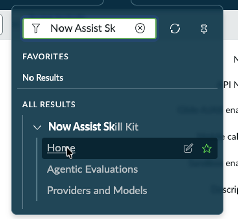

# Section 7. Now Assist Skill Kit (OPTIONAL)

Go to the following community site and familiarize yourself with the NASK features

&#x20;

<figure><figcaption></figcaption></figure>

&#x20;

Visit the following URL to see SEVERAL use cases that work with this lab setup

[ServiceNow Community Article: Now Assist Skill Kit Use Case Library](https://www.servicenow.com/community/now-assist-articles/now-assist-skill-kit-use-case-library/ta-p/3053580)

&#x20;

Congratulations, you have completed the lab!

