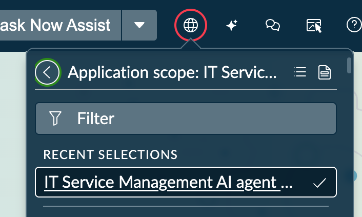

# Section 8.1 Now Assist Skill Kit

Creation and management of custom skills is done through Now Assist Skill Kit landing page. Before you start ensure that you are in the IT Service Management AI agent collection application scope.

<figure><figcaption></figcaption></figure>


You might also want to go to the incident (incident.list) table to create an incident that you can test with, however there is demo data in your instance that we can useYou might also want to go to the incident (incident.list) table to create an incident that you can test with, however there is demo data in your instance that we can use


1\. Navigate to Now Assist Skill Kit à Home to get started with a new skill creation, from there select: .png>)

2\. In the skill creation fill out the following:

* Skill name: Assignment group selector
* Description: This skill selects assignment groups based on information in the incident
* Default provider: Azure OpenAI
* Default provider API: Chat Completions\
  \
  Scroll down and add the itil role in the section “Apply role restrictions to skill”.\
  Then select Skip to Prompt editor.\
  \\

<figure><figcaption></figcaption></figure>

<figure><figcaption></figcaption></figure>


As an alternative we could have followed the guide to complete the prompt setup however we can save you time by jumping ahead.


3\. Now you can start building your skill:

<figure><figcaption></figcaption></figure>

3.1 Add an input by hitting +, for this we will use a String input since we will use it in an AI agent. Datatype: String, Name: incidentnumber (yes, in one word)

3.2 Add your prompt, to save you time we have created a prompt for you but you are free to modify the prompt if you want to change the response.\
Notice the inputs added in \{{brackets\}} we will add these in the next step.

```
You are an IT Service Management incident triage classifier. Your task is to
analyze a single incident and select the most appropriate assignment group
from a provided candidate list. You must return your answer as strict JSON.

## Incident
Short Description:
 {{LookupIncident.output.short_description}} 

Description:
 {{LookupIncident.output.description}} 

## Candidate assignment groups

The following JSON array contains every group that may receive this incident.
Each item has a sys_id, a name, and a description of the group's
responsibilities.

 {{assignmentgroup.output}} 

## How to choose

1. Read the short description and description together to identify:
   - The affected service, system, or technology (e.g. database, network,
     hardware, software, LDAP, change request, problem record).
   - The type of work required (e.g. troubleshooting, approval, access
     request, configuration change).
   - Any location or scope signals (e.g. "New York database", "Atlanta DB").

2. For each candidate group, weigh how well its name and description align
   with the incident. Prefer the most specialized group whose responsibilities
   explicitly cover the issue. Avoid generic catch-all groups unless no
   specialist group fits.

3. If two groups are close, prefer the one whose description directly names
   the technology, service, or location mentioned in the incident.

4. If no group is a clear specialist match, fall back to a general service
   desk or help desk group present in the candidate list. Do not invent a
   group.
5. self rate the confidence of your selection as a percentage number

## Output format

Return ONLY a single JSON object with exactly these three fields and nothing
else. No prose, no markdown fences, no comments, no trailing commas.

{
  "name": "<exact name copied from the chosen candidate>",
  "sys_id": "<exact sys_id copied from the chosen candidate>",
  "confidence": "90%"
}

Hard rules:
- The sys_id MUST be copied verbatim from one entry in the candidate list.
- The name MUST be copied verbatim from the same entry.
- Do not output any group that is not in the candidate list.
- Do not output explanations, reasoning, or apologies. JSON only.
```

3.3 Go to the “Add tools” tab to add tools.

<div align="left"><figure><figcaption></figcaption></figure></div>


In the tool editor we need to add two tools. For this exercise we will use script tools that are the fastest to add, however in a deployment we would rather recommend using a flow action or sub flows as these are easier to maintain and test.

